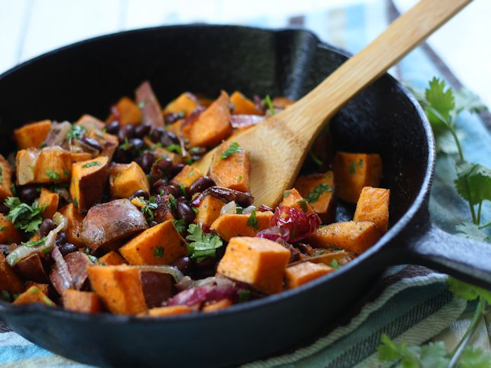

# Sweet Potato and Black Bean Bowl

This recipe will contain information on how to prepare and cook my favorite dish, __Sweet Potato and Black Bean Stir Fry Bowl__.

### What makes this meal special:
- Protein Packed & Filling
- Fast & Easy
- Vegan!
- Delicious & Nutritious
### There are 3 important steps:
- Ingredients
- Preparation
- Cooking Intructions

## Development and Contribution
I created this recipe by combining all of my favorite vegetables. I believe this is a great introduction and an easy start to vegan cooking!
Contribution to this README was found [here](https://github.com/lensapp/lens).

[Main Page](https://determined-hypatia-05f5e0.netlify.com/)
